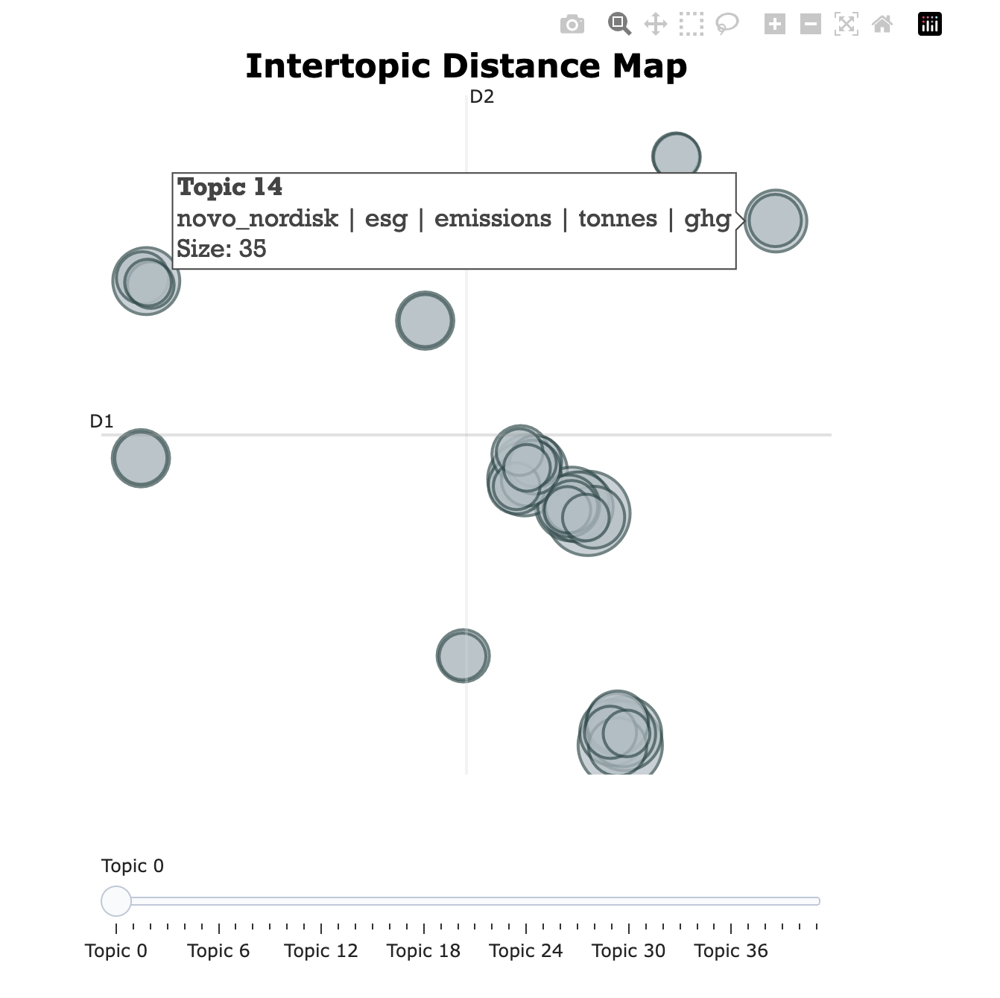

# RAG Redis

## Overview

In this demo, it includes mainly two things:

- Have a running chatbot powered by Redis 👉 [Follow this route](#rag-chatbot)
- Rip open the models and see what is inside 👉 [Follow this route](#what-is-inside)

## Some observations

### Create vectors
- Basic `TF-IDF vectorizer` performs much faster than Transformer models. With regard to quality of search result, it is also on par with Transformer models.
- Sub-word tokenizers perform better than character tokenizers with regard to number-heavy documents.
- The fine-tuned model does not perform better than the base ones.
- Pay attention to the parameters: `batch_size` and `pooling` method can impact the document embeddings.

### Search vectors
- Pay attention to the searching algorithms used in the embedded space: cosine similarity, KNN or MMR have different results.
- Topic modeling might help to reduce the searching space.

### Topics visualization

<p float="left">
    
</p>

## RAG chatbot

### Install

1. Install [redis-stack](https://redis.io/docs/install/install-stack/mac-os/) on MacOS and launch `redis-stack-server` and `redisinsight`:

Install redis-stack:
```bash
brew tap redis-stack/redis-stack
brew install redis-stack
```

Start redis-stack server and GUI:
```bash
redis-stack-server
redisinsight
```

2. Set the `OPENAI_API_KEY` environment variable to access the [OpenAI](https://platform.openai.com/) models:
```bash
export OPENAI_API_KEY=<YOUR OPENAI API KEY>
```

3. Set the following Redis environment variables:
```bash
export REDIS_HOST=<YOUR REDIS HOST>
export REDIS_PORT=<YOUR REDIS PORT>
export REDIS_USER=<YOUR REDIS USER NAME>
export REDIS_PASSWORD=<YOUR REDIS PASSWORD>
```

#### Supported settings

We use a variety of environment variables to configure this application:

| Environment Variable | Description                       | Default Value |
|----------------------|-----------------------------------|---------------|
| `DEBUG`            | Enable or disable Langchain debugging logs       | True         |
| `REDIS_HOST`           | Hostname for the Redis server     | "localhost"   |
| `REDIS_PORT`           | Port for the Redis server         | 6379          |
| `REDIS_USER`           | User for the Redis server         | "" |
| `REDIS_PASSWORD`       | Password for the Redis server     | "" |
| `REDIS_URL`            | Full URL for connecting to Redis  | `None`, Constructed from user, password, host, and port if not provided |
| `INDEX_NAME`           | Name of the vector index          | "rag-redis"   |

### Getting started

1. Create and activate your virtual environment:
```bash
python -m venv venv
source venv/bin/activate
```

2. Install the dependencies:
```bash
pip install -U langchain-cli pydantic==1.10.13
```

3. Create a new LangChain project, after this, a new folder [rag-chatbot](rag-chatbot) will be created:
```bash
langchain app new rag-chatbot --package rag-redis
```

4. To use the `rag-redis` package, add the following snippet to [server.py](rag-chatbot/app/server.py) just below `# Edit this to add the chain you want to add`:
```bash
from rag_redis.chain import chain as rag_redis_chain
add_routes(app, rag_redis_chain, path="/rag-redis")
```

5. Ingest source data for demo app by executing [ingest.py](rag-chatbot/packages/rag-redis/ingest.py):
```bash
cd rag-chatbot/packages/rag-redis
python ingest.py
```

> [!NOTE]
> You can replace the example Nike document with other PDFs.
> 
> You can update the prefix of your custom chunk as below in [ingest.py](rag-chatbot/packages/rag-redis/ingest.py):
> ```python
> # Load list of pdfs
> company_name = "Novo Nordisk"
> data_path = "data/"
> doc = [os.path.join(data_path, file) for file in os.listdir(data_path)][0]
> 
> print(f"Parsing doc for {company_name}", doc)
> ```

6. Serve the FastAPI app with [LangServe](https://github.com/langchain-ai/langserve) under the folder [rag-chatbot](rag-chatbot):
```bash
langchain serve
```

### Demo

Navigate to http://127.0.0.1:8000/docs to see documentation.

Visit http://127.0.0.1:8000/rag-redis/playground to use the testing playground, seen below:

<p float="left">
    
</p>

## What is inside

### Getting started

1. Install the requirements:
```bash
pip install -r requirements.txt
```

2. Install the kernel:
```bash
python -m ipykernel install --name rag-redis-demo --user
```

3. Start JupyterLab:
```bash
jupyter lab
```

## References

* https://huggingface.co/docs/transformers/tokenizer_summary
